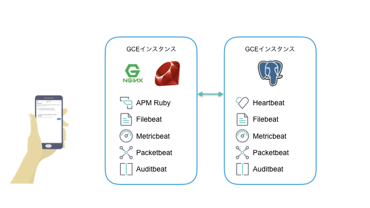

# monitoring-ruby-app
Monitoring Rails app with the Elastic Stack.
Elastic Stackを利用して、Ruby on Railsのアプリで構成されるシステムを監視するデモの目的のために作成したリポジトリ。

[説明用スライドはこちら](https://noti.st/johtani/eJPLbZ/elastic)。

## Features

アプリケーション、システムの監視の目的のために、Elastic Stackの以下のプロダクトを使用しています。

* Heartbeat : 死活監視、外形監視を行うためのBeats。詳細は[こちら](https://www.elastic.co/products/beats/heartbeat)。
* Metricbeat : 各種メトリック（サーバーのメトリック）を収集するためのBeats。詳細は[こちら](https://www.elastic.co/products/beats/metricbeat)。
* Filebeat : ファイルのテイル、ログ収集のためのBeats.詳細は[こちら](https://www.elastic.co/products/beats/filebeat)。
* Packetbeat : ネットワークパケットからDNSのリクエストなどを収集するためのBeats。詳細は[こちら](https://www.elastic.co/products/beats/packetbeat)。
* Elastic APM : Elasticsearch,Kibanaを使用したアプリケーションパフォーマンスモニタリングのツール。今回はRubyエージェントを使用。詳細は[こちら](https://www.elastic.co/products/apm)。
* Elasticsearch : 上記BeatsおよびElastic APMが収集したデータを保存するサーバー。詳細は[こちら](https://www.elastic.co/products/elasticsearch)。
* Kibana : 上記収集したデータを元に、監視のためのデータを可視化するためのサーバー。詳細は[こちら](https://www.elastic.co/products/kibana)。

## System Architecture

デモアプリとして、質問投稿アプリをRuby on Railsで構築しました。
以下のような2台のサーバー構成です。

アプリケーションは以下の3つのソフトウェアで構成されます。

* NGINX : Webサーバー。クライアントとHTTPS通信を行う。Ruby on Railsへのロードバランス。
* Ruby on Rails : 質問投稿アプリ本体。簡単な投稿＋投票機能を実装。その他に、APM説明用のControllerあり。
* PostgreSQL : データ永続化層。投稿された質問と、投票データを保持。

NGINX+Ruby on Railsをフロントエンドサーバーに、PostgreSQLをバックエンドサーバーにデプロイします。
（ローカル環境では、NGINXはRailsとは別のVMとして切り出してあります）。

なお、Beats、APMのデータ保存先には[Elastic Cloud Elasticsearch Service](https://www.elastic.co/products/elasticsearch/service)を使用しています。
Elastic Cloudを利用することで、

## Structure of repository

* gcp : GCPにデプロイするためのTerraform、Ansibleのファイルおよびデプロイ用の設定ファイル
* local : Docker on macOSで起動するためのdocker-compose.ymlおよび、各種設定ファイル
* nginx : localの環境で利用するためのNGINXのDockerfileと設定。
* ruby-app : Ruby on Railsのアプリ。

## Setup 

セッションで利用するデモ環境はGCP上に2つのGCEインスタンスを起動して、Beats、Elastic APM、アプリケーションをデプロイしています。

ローカルで動作させる方法としては、Dockerを利用できます。

### GCP

必要なツール : `gcloud`、`terraform`、`ansible`
必要な情報 : ドメイン

TODO : まだ途中

1. Create the Elastic Cloud instance with the same version as specified in variables.yml's elastic_version, enable Kibana as well as the GeoIP & user agent plugins, and set the environment variables with the values for ELASTICSEARCH_HOST, ELASTICSEARCH_USER, ELASTICSEARCH_PASSWORD, KIBANA_HOST, KIBANA_ID, APM_HOST, and APM_TOKEN.

### Local

TODO : まだ途中

#### Start

1. Run Docker
2. Change directory into `local`
3. `docker-compose up -f docker-compose-elastic-cloud.yml` if using Elastic Cloud
3. `docker-compose up` if all system in local

#### Shutdown

# References 

* https://github.com/xeraa/microservice-monitoring

 